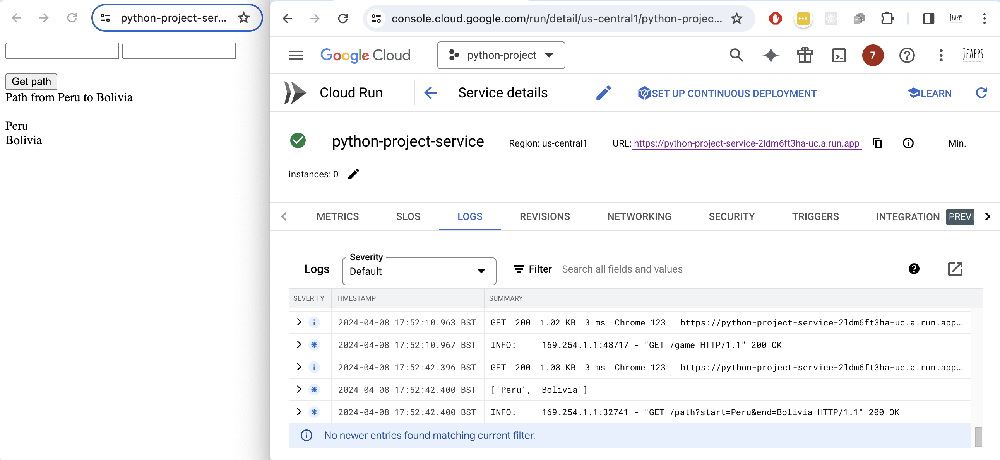
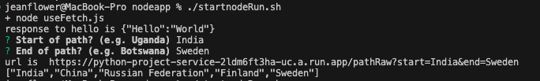
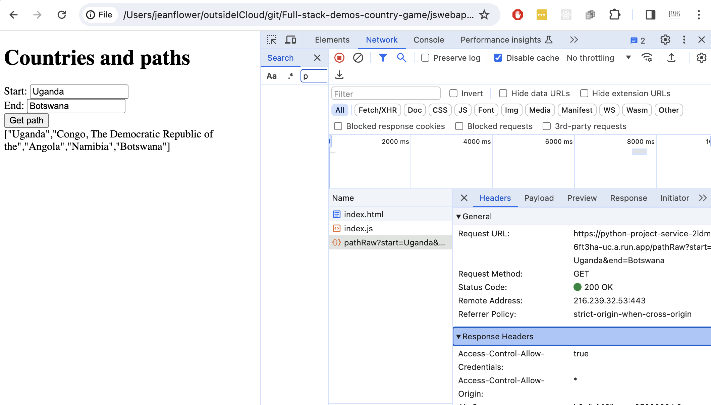
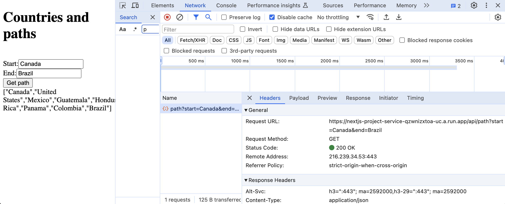

This repo is about delivering a python-backed compute result through a javascript web app.  The solutions are intended to provide bite-sized steps along the way to a full-stack web app.

## pythonapp

The pythonapp folder includes an algorithm in app/main.py, served using uvicorn. There are three scripts for running the python; one running directly, the second building a docker container, and the third builds and deploys a docker container in Google Cloud Platform (using Cloud Build and Cloud Run).

A deployed version of the game can be found at https://python-project-service-2ldm6ft3ha-uc.a.run.app/game

## nodeapp

There is a node app which can be run directly, and uses fetch to call the python-backed API.  Results are printed to the console.

The app queries for start and end countries and prints a path

## jswebapp

This is a futile attempt to call the API using the same javascript used for the nodejs app but inserting the result into an HTML page; porting the nodejs code into a web app.  This is doomed because of CORS rules - for security, browsers prohibit the calling of an unrelated API directly from the client code.

The website can only offer a fake response

## nextjsapp

Use the nextjs framework to writes client-side HTML and server-side fetch calls to build a working web app that uses the python API call on the back end.

## mongodbapp

A nodejs app which connects to a specified mongodb to perform some CRUD (create read update delete) operations.  The mongo database requires a database called crudExample. Create a .env.local file in the monfoapp folder (your env file will be gitignored) and follow the pattern of .env.sample, to point the code at your mongoDB location.

## more steps

 - Use typescript instead of javascript
 - Styling using bootstrap and CSS
 - nextjs routing, server-side work, middleware

