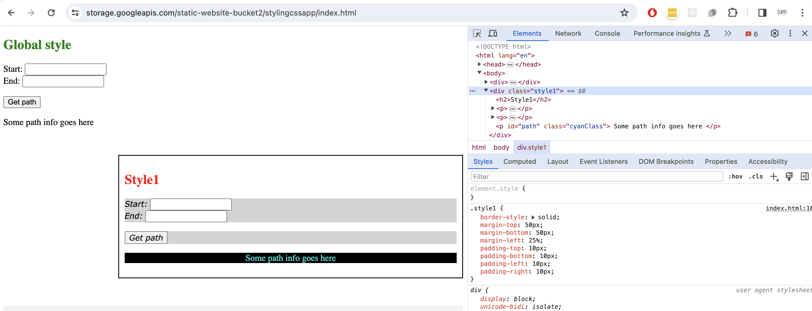
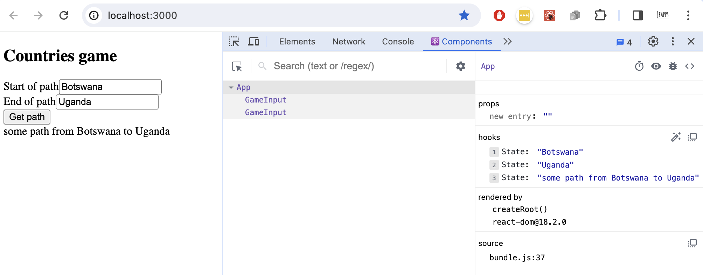

This repo is about delivering a python-backed compute result through a javascript web app.  The solutions are intended to provide bite-sized steps along the way to a full-stack web app.

# Front end 

## jswebapp

[Link to folder](jswebapp)

This includes an HTML file for our game with input fields to fill in and a button to click.  

When the button is clicked, a response is computed on the client; in the browser.

The client is unable to get a response back from any server-side logic to compute a result; for security, browsers prohibit the calling of an unrelated API directly from client code.  They instead issue CORS errors.


## stylingcssapp

[Link to folder](stylingcssapp)

A demo of various css styling controls.  Refer to https://www.w3schools.com/css/ for more.  To run, load index.html into a browser and explore making changes to mystyles.css.



## reactapp

[Link to folder](reactapp)

React is a javascript front-end library created by Facebook.  React apps are built out of react components, and use JSX syntax, a kind of hybrid between HTML and js. They are designed to be .. reactive.  Have a look at ```npm test``` as well.


# Backend

## pythonapp

[Link to folder](pythonapp)

The pythonapp folder includes an algorithm in app/main.py, served using uvicorn. There are three scripts for running the python; one running directly, the second building a docker container, and the third builds and deploys a docker container in Google Cloud Platform (using Cloud Build and Cloud Run).

A deployed version of the game can be found at https://python-project-service-2ldm6ft3ha-uc.a.run.app/game


## nodeapp

[Link to folder](nodeapp)

There is a node app which can be run directly, and uses fetch to call the python-backed API.  Results are printed to the console.

The app queries for start and end countries and prints a path


## mongoapp

[Link to folder](mongoapp)

A nodejs app which connects to a specified mongodb (mongo database) to perform some CRUD (create read update delete) operations.  The mongo database requires a database called crudExample. Create a .env.local file in the monfoapp folder (your env file will be gitignored) and follow the pattern of .env.sample, to point the code at your mongoDB location.

# Full stack

## nextjsapp

[Link to folder](nextjsapp)

Use the nextjs framework to writes client-side HTML and server-side fetch calls to build a working web app that uses the python API call on the back end.  A deployed version of the app can be found at https://nextjs-project-service-qzwnizxtoa-uc.a.run.app/


# More steps

 - Use typescript instead of javascript
 - Styling using bootstrap
 - nextjs routing, server-side work, middleware

